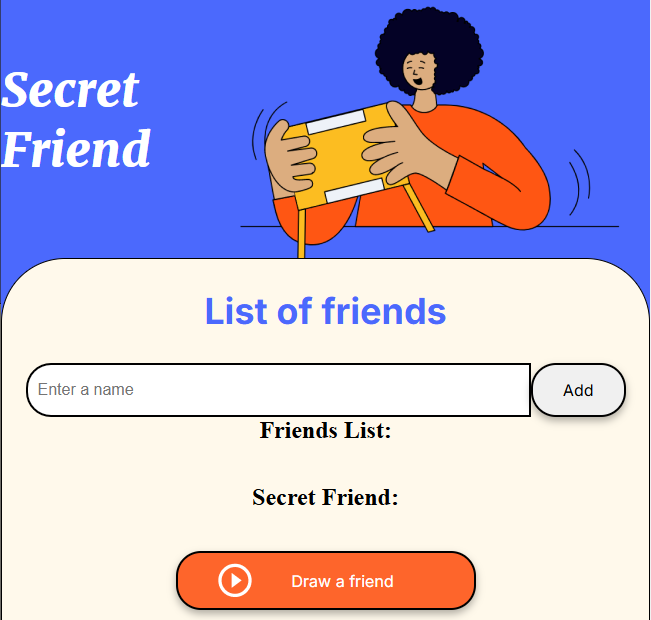

# secretFriend

This is a minimal web application designed to showcase the general idea of front-end integration using HTML, CSS, and Javascript. 

The project allows users to dynamically add friends' names through an input field and select one at random with the click of a button. It serves as a demonstration of basic web development concepts, including DOM manipulation, event handling, and user interaction.

# Developed with

- Html
- CSS
- Javascript

# Screenshot

